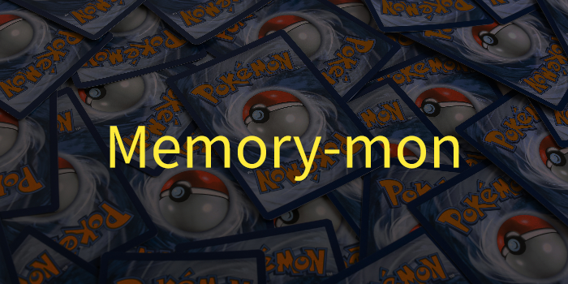

 

## Basic Overview

Pokemon themed memory card game, avoid picking the same card twice to get a satisfying victory!

## Demo:
https://github.com/modMars/memory-mon/assets/90658669/cfe2fd28-18da-4381-9492-553642de46c6

## Key Features

- 5 round matches.
- Featuring your favorite pokemon from generation 1 all the way to generation 4!.

## Learned / improved concepts

- React hooks (useEffect, useState)
- Asynchronous programming
- API fetching

## Things to improve on

- Organization
- Deeper understanding of React
